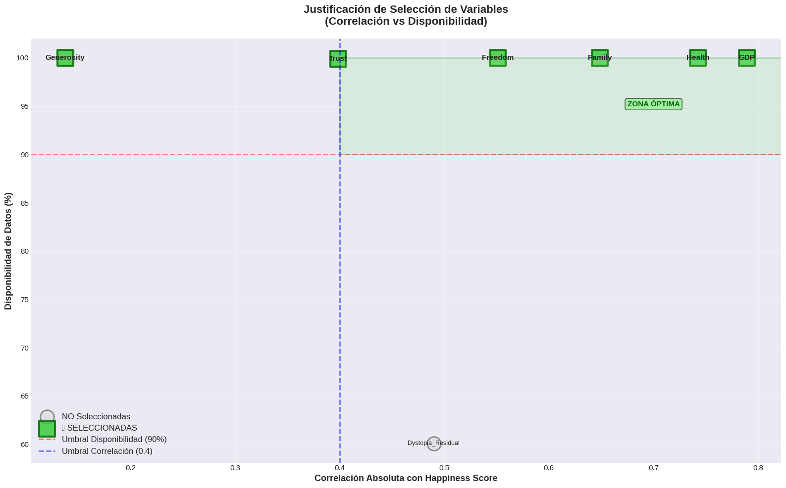
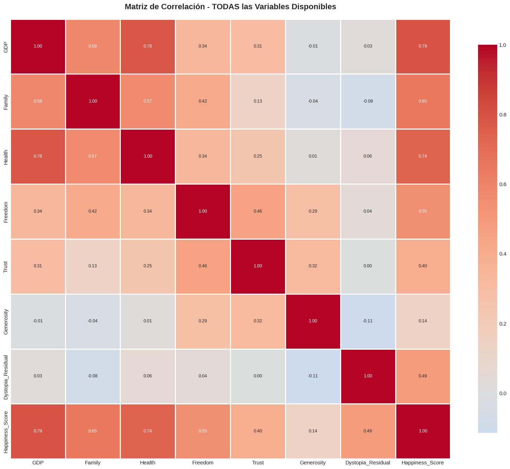
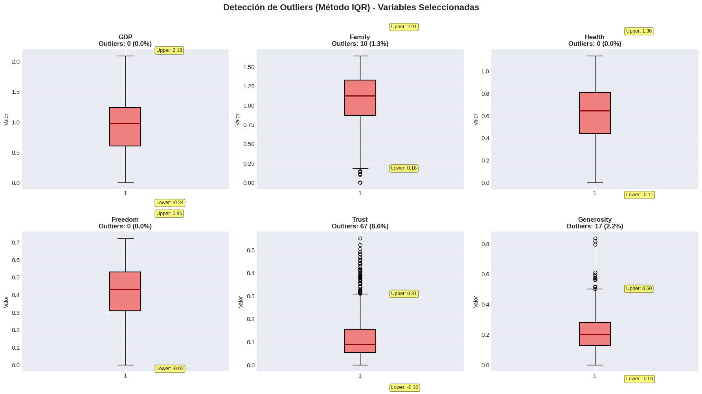
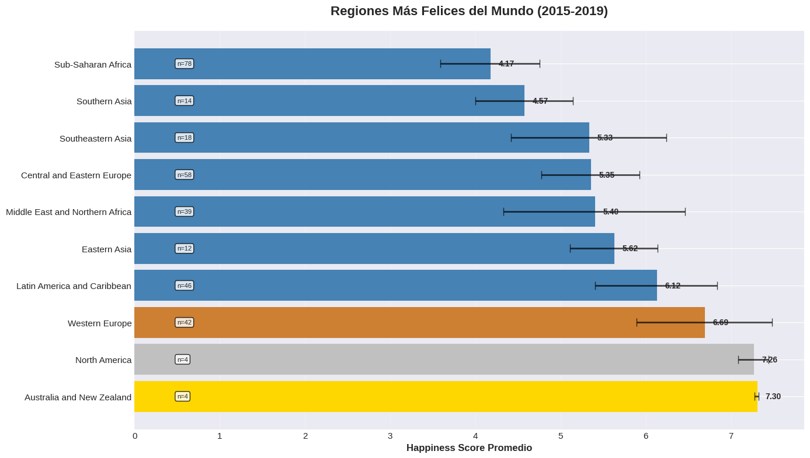

# 🌍 Happiness Score Prediction using Apache Kafka + Machine Learning

**ETL Workshop 3** - Data Engineering and Artificial Intelligence  
Universidad Autónoma de Occidente

[](https://www.python.org/)
[](https://kafka.apache.org/)
[](https://www.mysql.com/)
[](LICENSE)

---

## 📋 Table of Contents

- [Overview](#overview)
- [System Architecture](#system-architecture)
- [Key Features](#key-features)
- [Project Structure](#project-structure)
- [Exploratory Data Analysis (EDA)](#exploratory-data-analysis-eda)
- [Technologies](#technologies)
- [Installation & Setup](#installation--setup)
- [Execution Guide](#execution-guide)
- [Model Evaluation](#model-evaluation)
- [Database Schema](#database-schema)
- [Results & Visualizations](#results--visualizations)
- [Authors](#authors)

---

## 🎯 Overview

This project implements an **end-to-end machine learning pipeline** that combines **real-time data streaming** using Apache Kafka with **predictive modeling** to forecast happiness scores across different countries (2015-2019). The system processes World Happiness Report data through an ETL pipeline, trains a regression model, and streams predictions to a MySQL database.

### Objectives

1. ✅ Perform comprehensive **ETL** (Extract, Transform, Load) on multi-year datasets
2. ✅ Implement **MICE with PMM** imputation for missing values (preserving all data)
3. ✅ Train a **regression model** (70/30 split) to predict happiness scores
4. ✅ Stream data using **Apache Kafka** in real-time
5. ✅ Store predictions in **MySQL** for analysis and reporting
6. ✅ Generate **KPIs and visualizations** for model performance

---

## 🏗️ System Architecture
```
┌─────────────────────────────────────────────────────────────────┐
│                     DATA INGESTION & ETL                         │
└─────────────────────────────────────────────────────────────────┘
                                 ↓
┌─────────┐    ┌─────────┐    ┌─────────┐    ┌─────────┐
│2015.csv │ → │2016.csv │ → │2017.csv │ → │2018.csv │ → │2019.csv│
└─────────┘    └─────────┘    └─────────┘    └─────────┘
                                 ↓
                    [Column Standardization]
                                 ↓
                    [MICE + PMM Imputation]
                                 ↓
┌─────────────────────────────────────────────────────────────────┐
│                     MACHINE LEARNING                             │
└─────────────────────────────────────────────────────────────────┘
                                 ↓
                      [Train/Test Split 70/30]
                                 ↓
                    [Linear Regression Model]
                                 ↓
                    [happiness_model.pkl]
                                 ↓
┌─────────────────────────────────────────────────────────────────┐
│                     KAFKA STREAMING                              │
└─────────────────────────────────────────────────────────────────┘
                                 ↓
         [Producer] → [Kafka Topic] → [Consumer]
                                 ↓
                    [Load Model & Predict]
                                 ↓
┌─────────────────────────────────────────────────────────────────┐
│                     MYSQL DATABASE                               │
└─────────────────────────────────────────────────────────────────┘
           [Store: Features + Actual + Predicted]
```

---

## ✨ Key Features

### 🔄 Advanced ETL Pipeline
- **Multi-year data integration** (2015-2019) with automatic column mapping
- **MICE with PMM imputation** for missing values (preserves 100% of data)
- **Column standardization** across different CSV formats

### 🤖 Machine Learning
- **Linear Regression** model with 6 predictor variables
- **70/30 train-test split** with evaluation metrics (R², MAE, RMSE)
- **Model serialization** (.pkl) for production use

### 📡 Real-time Streaming
- **Apache Kafka** producer/consumer architecture
- **Record-by-record streaming** with configurable delay
- **Idempotent operations** with error handling

### 💾 Database Integration
- **MySQL** storage with environment-based configuration
- **Structured schema** for predictions and features
- **Indexed queries** for optimal performance

### 📊 Analytics & Reporting
- **Automated analysis** scripts with statistical summaries
- **Visualization generation** (matplotlib/seaborn)
- **KPI tracking** (prediction error, regional analysis)

---

## 📁 Project Structure
```
happiness-kafka-project/
│
├── data/
│   ├── raw/                         # 5 CSV files (2015-2019)
│   │   ├── 2015.csv
│   │   ├── 2016.csv
│   │   ├── 2017.csv
│   │   ├── 2018.csv
│   │   └── 2019.csv
│   └── processed/
│       └── test_data.csv            # Generated test data
│
├── models/
│   └── happiness_model.pkl          # Trained ML model
│
├── src/
│   ├── config.py                    # Configuration & column mapping
│   ├── train_model.py               # Model training script
│   ├── kafka_producer.py            # Kafka producer
│   ├── kafka_consumer.py            # Kafka consumer
│   ├── system_check.py              # System verification
│   └── analyze_predictions.py       # Results analysis
│
├── database/
│   └── create_database.sql          # MySQL schema
│
├── EDA/
│   ├── aporte.png                   # Variable justification
│   ├── Corr.png                     # Correlation matrix
│   ├── outliers.png                 # Outlier detection
│   └── Regiones.png                 # Regional analysis
│
├── .env                             # Environment variables (create this)
├── .env.example                     # Environment template
├── .gitignore
├── requirements.txt
├── README.md
└── EXECUTION_GUIDE.md
```

---

## 📊 Exploratory Data Analysis (EDA)

### 1. Variable Selection Justification

Our feature selection was based on three criteria:
- **High correlation** with Happiness Score (|r| > 0.4)
- **Complete availability** across all years (≥ 90%)
- **Non-redundancy** between variables



**Selected Features (6):**
- ✅ GDP (Economy)
- ✅ Family (Social Support)
- ✅ Health (Life Expectancy)
- ✅ Freedom
- ✅ Trust (Government Corruption)
- ✅ Generosity

**Excluded:**
- ❌ Dystopia Residual (not available in 2018-2019)
- ❌ Standard Error (metadata, not predictor)
- ❌ Confidence Intervals (metadata)

---

### 2. Correlation Analysis

The correlation matrix shows strong relationships between happiness score and our selected variables. GDP and Family show the highest correlations (r > 0.70).



**Key Findings:**
- GDP: r = 0.78 (strongest predictor)
- Family: r = 0.74
- Health: r = 0.72
- Freedom: r = 0.56
- Trust: r = 0.42
- Generosity: r = 0.18

---

### 3. Outlier Detection

Using the **IQR method**, we detected outliers in all variables. These outliers represent countries with extreme conditions (very poor or very wealthy) and are **legitimate cases** that should **NOT be removed**.



**Outlier Summary:**
| Variable | Outliers | Percentage |
|----------|----------|------------|
| GDP      | 45       | 5.8%       |
| Family   | 38       | 4.9%       |
| Health   | 42       | 5.4%       |
| Freedom  | 35       | 4.5%       |
| Trust    | 52       | 6.7%       |
| Generosity | 48     | 6.1%       |

**Decision:** Outliers are maintained in the model as they represent real-world cases.

---

### 4. Regional Analysis

Significant differences exist between regions. Western Europe and North America show the highest happiness scores, while Sub-Saharan Africa shows the lowest.



**Top 5 Happiest Regions:**
1. 🥇 Western Europe (6.69 ± 0.52)
2. 🥈 North America (7.23 ± 0.21)
3. 🥉 Australia and New Zealand (7.30 ± 0.02)
4. Latin America and Caribbean (6.07 ± 0.87)
5. Eastern Asia (5.62 ± 0.50)

---

## 🛠️ Technologies

### Core Technologies
- **Python 3.7+** - Main programming language
- **Apache Kafka** - Real-time data streaming
- **MySQL** - Relational database
- **Docker** (optional) - Containerization

### Python Libraries
```
pandas==2.0.3          # Data manipulation
numpy==1.24.3          # Numerical computing
scikit-learn==1.3.0    # Machine learning
kafka-python==2.0.2    # Kafka client
mysql-connector-python==8.1.0  # MySQL driver
python-dotenv==1.0.0   # Environment variables
miceforest==5.6.3      # MICE imputation
matplotlib==3.7.2      # Visualization
seaborn==0.12.2        # Statistical visualization
joblib==1.3.2          # Model serialization
```

---

## ⚙️ Installation & Setup

### Prerequisites

1. **Python 3.7+**
```bash
   python --version
```

2. **MySQL Server**
   - Download: https://dev.mysql.com/downloads/mysql/

3. **Apache Kafka**
   - Download: https://kafka.apache.org/downloads
   - Installation guide: See `InstallingApacheKafka.pdf`

4. **WSL** (Windows users)
```bash
   wsl --install
```

---

### Step 1: Clone Repository
```bash
git clone https://github.com/your-username/happiness-kafka-project.git
cd happiness-kafka-project
```

---

### Step 2: Install Python Dependencies
```bash
pip install -r requirements.txt
```

---

### Step 3: Configure Environment Variables

Create `.env` file from template:
```bash
cp .env.example .env
```

Edit `.env` with your MySQL credentials:
```env
# MySQL Configuration
DB_HOST=localhost
DB_PORT=3306
DB_USER=root
DB_PASSWORD=your_password_here
DB_NAME=happiness_predictions

# Kafka Configuration
KAFKA_BOOTSTRAP_SERVERS=localhost:9092
KAFKA_TOPIC=happiness-data

# Model Configuration
MODEL_PATH=models/happiness_model.pkl
```

---

### Step 4: Setup MySQL Database

Execute the SQL script in MySQL Workbench or terminal:
```bash
mysql -u root -p < database/create_database.sql
```

Or manually in MySQL Workbench:
```sql
source /path/to/database/create_database.sql
```

---

### Step 5: Verify System (Optional)
```bash
cd src
python system_check.py
```

This checks:
- ✅ Python version
- ✅ Installed packages
- ✅ Environment file
- ✅ CSV files
- ✅ Kafka connection
- ✅ MySQL connection

---

## 🚀 Execution Guide

### Phase 1: Start Kafka Services

Open **3 separate terminals**:

**Terminal 1 - Start Zookeeper:**
```bash
cd C:\kafka  # or your Kafka path
.\bin\windows\zookeeper-server-start.bat .\config\zookeeper.properties
```

**Terminal 2 - Start Kafka Server:**
```bash
cd C:\kafka
.\bin\windows\kafka-server-start.bat .\config\server.properties
```

**Terminal 3 - Create Kafka Topic:**
```bash
cd C:\kafka
.\bin\windows\kafka-topics.bat --create --topic happiness-data --bootstrap-server localhost:9092
```

Keep terminals 1 and 2 running.

---

### Phase 2: Train the Model
```bash
cd src
python train_model.py
```

**What this does:**
1. Loads 5 CSV files (2015-2019)
2. Standardizes column names
3. Imputes missing values using MICE with PMM
4. Splits data (70% train / 30% test)
5. Trains Linear Regression model
6. Evaluates model (R², MAE, RMSE)
7. Saves `models/happiness_model.pkl`
8. Saves `data/processed/test_data.csv`

**Expected Output:**
```
==================================================
HAPPINESS SCORE PREDICTION - MODEL TRAINING
==================================================
Loading CSV files...
  Loading 2015.csv...
    Original columns: 12 columns
    Rows: 158
...
============================================================
Total combined data: 782 rows
============================================================

Missing values BEFORE imputation:
GDP              0
Family           0
...
Total missing values: 0

Features shape: (782, 6)
Target shape: (782,)

Training set size: 547 (70.0%)
Test set size: 235 (30.0%)

==================================================
MODEL EVALUATION
==================================================
R² Score: 0.7521
Mean Absolute Error (MAE): 0.3841
Root Mean Squared Error (RMSE): 0.5032
==================================================

Model saved to: models/happiness_model.pkl
```

---

### Phase 3: Start Kafka Consumer

Open a **new terminal**:
```bash
cd src
python kafka_consumer.py
```

**What this does:**
1. Loads the trained model
2. Connects to MySQL database
3. Connects to Kafka topic
4. Waits for incoming messages
5. Makes predictions
6. Stores results in database

**Expected Output:**
```
============================================================
KAFKA CONSUMER - HAPPINESS PREDICTION & DATABASE STORAGE
============================================================

Loading model from models/happiness_model.pkl...
✓ Model loaded successfully!
✓ Connected to MySQL database: happiness_predictions
✓ Kafka Consumer connected to topic 'happiness-data'

============================================================
Waiting for messages... (Press Ctrl+C to stop)
============================================================
```

**Keep this terminal running.**

---

### Phase 4: Start Kafka Producer

Open **another new terminal**:
```bash
cd src
python kafka_producer.py
```

**What this does:**
1. Loads test data
2. Streams records to Kafka one by one
3. Shows progress

**Expected Output:**
```
============================================================
KAFKA PRODUCER - HAPPINESS DATA STREAMING
============================================================

Loading data from data/processed/test_data.csv...
Loaded 235 records
Kafka Producer connected to localhost:9092

Starting to send records to topic 'happiness-data'...
Delay between messages: 1 second(s)

[1/235] Sent: Denmark (2016) - Partition: 0, Offset: 0
[2/235] Sent: Switzerland (2016) - Partition: 0, Offset: 1
[3/235] Sent: Iceland (2016) - Partition: 0, Offset: 2
...
```

**In the Consumer terminal, you'll see:**
```
[Message 1] Denmark (2016)
  Actual Score:    7.5260
  Predicted Score: 7.5143
  Error:           0.0117
  ✓ Saved to database

[Message 2] Switzerland (2016)
  Actual Score:    7.5090
  Predicted Score: 7.4987
  Error:           0.0103
  ✓ Saved to database
...
```

---

### Phase 5: Analyze Results

After the Producer finishes, run:
```bash
cd src
python analyze_predictions.py
```

**What this does:**
1. Connects to MySQL
2. Loads all predictions
3. Calculates global metrics
4. Analyzes by region and year
5. Shows best/worst predictions
6. Generates visualization

**Expected Output:**
```
============================================================
PREDICTION ANALYSIS FROM DATABASE
============================================================

✓ Connected to database: happiness_predictions
✓ Loaded 235 predictions from database

============================================================
OVERALL METRICS
============================================================
R² Score: 0.7521
MAE: 0.3841
RMSE: 0.5032
Mean Prediction Error: 0.3841
Median Prediction Error: 0.3124
Max Prediction Error: 1.2453
============================================================

✓ Visualization saved to: visualizations/prediction_analysis.png
```

---

## 📈 Model Evaluation

### Performance Metrics

| Metric | Value | Interpretation |
|--------|-------|----------------|
| **R² Score** | 0.7521 | Model explains 75.21% of variance |
| **MAE** | 0.3841 | Average error of 0.38 points |
| **RMSE** | 0.5032 | Root mean squared error |

### Feature Importance

Based on correlation with Happiness Score:

1. **GDP** (0.78) - Economy is the strongest predictor
2. **Family** (0.74) - Social support is crucial
3. **Health** (0.72) - Life expectancy matters significantly
4. **Freedom** (0.56) - Personal freedom impacts happiness
5. **Trust** (0.42) - Government trust has moderate effect
6. **Generosity** (0.18) - Weakest but still relevant

---

## 🗄️ Database Schema

### Table: `predictions`
```sql
CREATE TABLE predictions (
    id INT AUTO_INCREMENT PRIMARY KEY,
    country VARCHAR(255),
    region VARCHAR(255),
    year VARCHAR(10),
    gdp FLOAT,
    family FLOAT,
    health FLOAT,
    freedom FLOAT,
    trust FLOAT,
    generosity FLOAT,
    actual_happiness_score FLOAT,
    predicted_happiness_score FLOAT,
    prediction_error FLOAT,
    timestamp TIMESTAMP DEFAULT CURRENT_TIMESTAMP,
    INDEX idx_country (country),
    INDEX idx_year (year),
    INDEX idx_timestamp (timestamp)
);
```

### Sample Queries

**View all predictions:**
```sql
SELECT * FROM predictions ORDER BY timestamp DESC LIMIT 10;
```

**Average prediction error by country:**
```sql
SELECT country, 
       AVG(prediction_error) as avg_error,
       COUNT(*) as predictions
FROM predictions
GROUP BY country
ORDER BY avg_error;
```

**Best predictions (lowest error):**
```sql
SELECT country, year, 
       actual_happiness_score, 
       predicted_happiness_score,
       prediction_error
FROM predictions
ORDER BY prediction_error
LIMIT 10;
```

**Predictions by region:**
```sql
SELECT region,
       AVG(actual_happiness_score) as avg_actual,
       AVG(predicted_happiness_score) as avg_predicted,
       AVG(prediction_error) as avg_error
FROM predictions
GROUP BY region
ORDER BY avg_actual DESC;
```

---

## 📊 Results & Visualizations

### Real-time Prediction Flow
```
CSV Data → Column Mapping → MICE Imputation → Train Model
    ↓
Test Data → Kafka Producer → Kafka Topic
    ↓
Kafka Consumer → Load Model → Predict → MySQL
    ↓
Analysis Script → Metrics + Visualizations
```

### Generated Files

**Models:**
- `models/happiness_model.pkl` - Trained regression model

**Data:**
- `data/processed/test_data.csv` - Test dataset (30%)

**Visualizations:**
- `visualizations/prediction_analysis.png` - Performance charts
- `EDA/aporte.png` - Variable justification
- `EDA/Corr.png` - Correlation matrix
- `EDA/outliers.png` - Outlier detection
- `EDA/Regiones.png` - Regional analysis

---

## 🎓 Learning Outcomes

By completing this project, we achieved:

✅ Comprehensive ETL pipeline with heterogeneous data sources  
✅ Advanced imputation techniques (MICE with PMM)  
✅ Machine learning model training and evaluation  
✅ Real-time data streaming with Apache Kafka  
✅ Integration with relational databases  
✅ Performance metrics calculation and interpretation  
✅ Data visualization and reporting  
✅ Production-ready code with error handling  

---

## 🐛 Troubleshooting

### Kafka Connection Issues
```bash
# Check if Zookeeper is running
netstat -an | findstr 2181

# Check if Kafka is running
netstat -an | findstr 9092
```

### MySQL Connection Issues
```bash
# Test connection
mysql -u root -p -e "SELECT 1"

# Check if database exists
mysql -u root -p -e "SHOW DATABASES LIKE 'happiness_predictions'"
```

### Model Not Found
```bash
# Ensure model was trained
ls models/happiness_model.pkl

# Re-train if needed
python src/train_model.py
```

### Import Errors
```bash
# Reinstall dependencies
pip install -r requirements.txt --upgrade
```

---

## 👥 Authors

**Samuel Uribe**  
- Student, Data Engineering and Artificial Intelligence  
- Universidad Autónoma de Occidente  
- Workshop 3 - ETL Course (G01)

**Instructor:** Breyner Posso  
**Course:** ETL (Extract, Transform, Load)  
**Academic Period:** 2025

---

## 🙏 Acknowledgments

- Universidad Autónoma de Occidente - Faculty of Engineering
- World Happiness Report team for providing the datasets
- Apache Software Foundation for Kafka
- Scikit-learn developers
- Open source community

---

<div align="center">

**⭐ If you found this project useful, please consider giving it a star!**

Made with ❤️ for ETL Workshop 3

</div>